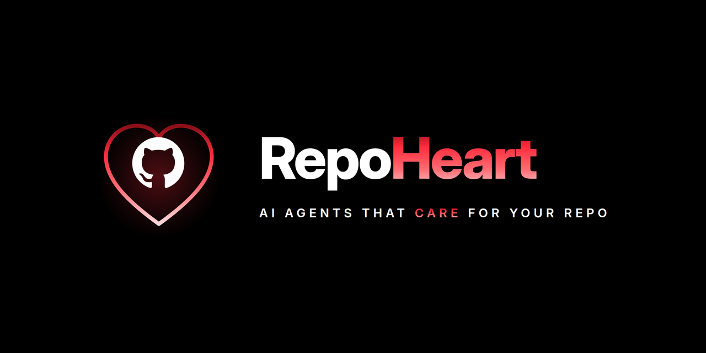

<div align="center">

# ❤️ RepoHeart



**The autonomous heart of your GitHub repository.**

A 24/7, event-driven, multi-agent system that watches your repo and automatically activates specialized AI agents to triage issues, review PRs, repair CI, resolve conflicts, and keep the repository healthy — safely, and provider-agnostically.

</div>

---

## Why

Maintaining an active repository is endless manual work: triaging issues, spotting duplicates, checking what was already fixed, reviewing PRs, watching CI, resolving conflicts, keeping docs current. RepoHeart automates the repetitive parts while keeping humans in control of anything risky.

It runs **entirely inside your GitHub Actions workflow** — no hosted server, no database, no external infrastructure. Add one workflow, choose an AI provider, done.

---

## How It Works

```text
GitHub Event → Actions runner → normalize + dedup → route to agents
            → each agent retrieves bounded context, reasons, proposes actions
            → Safety Gate authorizes every write
            → results written back to GitHub → run exits (holds no state)
```

Deterministic where it must be (routing, permissions, idempotency), AI-driven where it helps (the reasoning inside each agent).

---

## Quick Start

**1. Add the workflow** — `.github/workflows/repoheart.yml`:

```yaml
name: RepoHeart
on:
  issues:
    types: [opened, edited]
  pull_request:
    types: [opened, synchronize, reopened]
  workflow_run:
    types: [completed]

permissions:
  contents: write
  issues: write
  pull-requests: write

jobs:
  repoheart:
    runs-on: ubuntu-latest
    steps:
      - uses: actions/checkout@v4
      - uses: OpenAgentHQ/repoheart@main
        with:
          config: opencode.yml
```

**2. Configure** — `opencode.yml`:

```yaml
repoheart:
  provider:
    name: opencode          # opencode | claude | openai | gemini | local
    model: your-model
  agents:
    issue_triage: true
    duplicate_detection: true
    pr_review: true
    code_quality: true
    security: true
    ci_repair: true
    conflict_resolution: true
```

**3. Add provider credentials** as repository secrets (e.g. `OPENCODE_API_KEY`, `ANTHROPIC_API_KEY`, `OPENAI_API_KEY`).

That's it.

---

## The Agents

| Agent | Does |
|---|---|
| Issue Triage | Classifies, labels, and summarizes new issues |
| Duplicate Detection | Finds duplicate/related issues |
| Issue Resolution | Detects issues already fixed by prior PRs/commits |
| PR Review | Coherent review of correctness, quality, and risk |
| Code Quality | Lint / format / type checks on changed paths |
| Security | Secret + dependency scanning on the diff |
| CI Repair | Diagnoses CI failures and attempts safe, verified fixes |
| Conflict Resolution | Resolves safe merge conflicts; escalates the rest |
| Test | Test-impact mapping and test generation |
| Documentation | Keeps docs current with changed public symbols |

Enable only what you want in `opencode.yml`.

---

## Switching AI Providers

Change one line. Agents are untouched.

```yaml
provider:
  name: claude      # was: opencode
  model: claude-model
```

---

## Built for Big Repos Too

RepoHeart doesn't load your whole codebase into a prompt. It **retrieves** only what each event needs — using tree-sitter, ripgrep, and GitHub Search to do the heavy lifting, with event-scoped (sparse/shallow) checkout and an optional content-hash cache. Cost scales with the event's blast radius, not your repo size.

---

## Safety First

> Safety first, then correctness, then automation.

- Every write passes a mandatory Safety Gate.
- Agents can never escalate their own permissions.
- No force-push. No auto-merge in the MVP. No committed secrets.
- Low-confidence or high-risk situations escalate to a human with a clear explanation — never a silent guess, never broken state left behind.

---

## Documentation

| Doc | Purpose |
|---|---|
| [PROJECT.md](PROJECT.md) | Overview and orientation |
| [ARCHITECTURE.md](ARCHITECTURE.md) | Condensed architecture reference |
| [ROADMAP.md](ROADMAP.md) | Phased build plan |
| [CONTRIBUTING.md](CONTRIBUTING.md) | Dev setup and conventions |
| [CLAUDE.md](CLAUDE.md) | Rules for AI coding agents |
| `docs/repoheart-final-system-design.md` | Full authoritative system design |

---

## Status

**Early development (Phase 0–1).** Architecture and docs are locked; core runtime is being built. See [ROADMAP.md](ROADMAP.md).

---

## License

See [LICENSE](LICENSE).

<div align="center">

**RepoHeart is not just a bot. It's an autonomous repository engineering system.**

</div>
