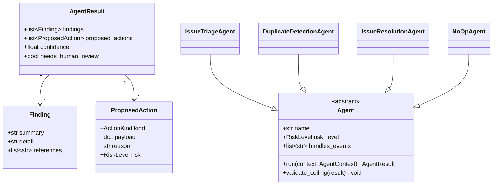
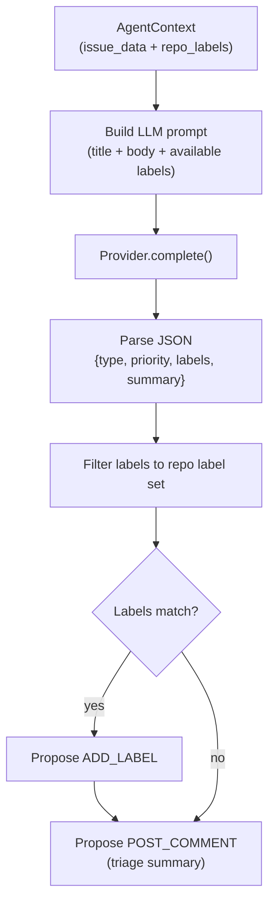
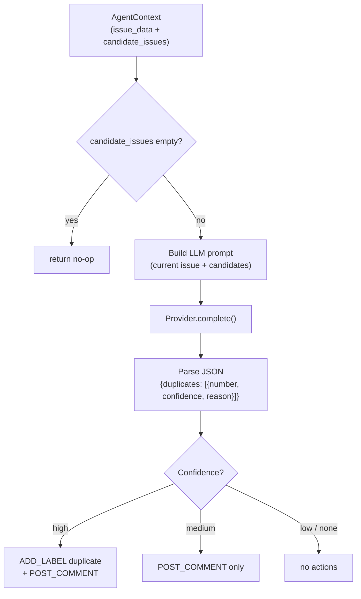
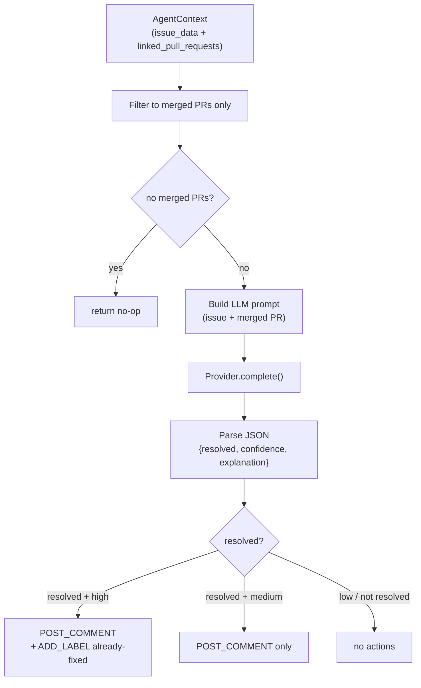

# Agents — Contract and Execution Flow

This document describes the `repoheart/agents/` package: the `Agent` base
class, the result types an agent returns, and how the three Phase 3 agents
flow from an `AgentContext` input to an `AgentResult` output. It is intended
to help contributors understand what they need to implement when adding a new
agent.

## Part 1 — Agent ABC and result types

`Agent` is an abstract base class. Subclasses set `name`, `risk_level`, and
`handles_events`, and implement `run()`, which returns a declarative
`AgentResult`. An agent never executes writes — the orchestrator and Safety
Gate decide which `ProposedAction`s actually run.

## Part 2 — AgentContext fields

`AgentContext` is a frozen dataclass; it is the read-only view of the world
passed into every agent. The orchestrator pre-fetches data so agents never
hold live clients.

| Field | Type | Notes |
| --- | --- | --- |
| `event` | `InternalEvent` | Normalized GitHub event that triggered the agent |
| `config` | `RepoHeartConfig` | Validated configuration for the repository |
| `provider` | `Provider \| None` | AI provider for this run |
| `issue_data` | `dict \| None` | Pre-fetched issue payload for `issues.*` events |
| `pr_data` | `dict \| None` | Pre-fetched PR payload for `pull_request.*` events |
| `diff` | `str` | Unified diff for PR/push events |
| `changed_files` | `list[str]` | Relative paths of changed files |
| `fingerprint` | `str` | Unique per-run fingerprint (for logging) |
| `repo_labels` | `list[dict]` | Pre-fetched for `issue_triage` |
| `candidate_issues` | `list[dict]` | Pre-fetched for `duplicate_detection` |
| `linked_pull_requests` | `list[dict]` | Pre-fetched for `issue_resolution` |

The three Phase 3-specific fields are `repo_labels`, `candidate_issues`, and
`linked_pull_requests`.

## Part 3 — Per-agent execution flow

### IssueTriageAgent

### DuplicateDetectionAgent

### IssueResolutionAgent

## Part 4 — AGENT_REGISTRY

The registry maps agent names to implementing classes. In Phase 1 every slot
pointed to `NoOpAgent`; real implementations replace individual entries as
each phase is completed.

| Agent slot | Implementation |
| --- | --- |
| `issue_triage` | `IssueTriageAgent` |
| `duplicate_detection` | `DuplicateDetectionAgent` |
| `issue_resolution` | `IssueResolutionAgent` |
| `pr_review` | `NoOpAgent` |
| `code_quality` | `NoOpAgent` |
| `security` | `NoOpAgent` |
| `ci_repair` | `NoOpAgent` |
| `conflict_resolution` | `NoOpAgent` |
| `test` | `NoOpAgent` |
| `documentation` | `NoOpAgent` |
