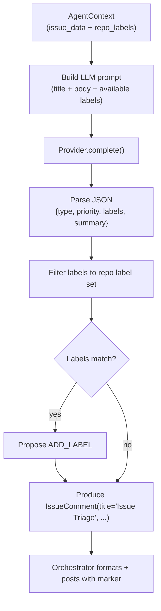
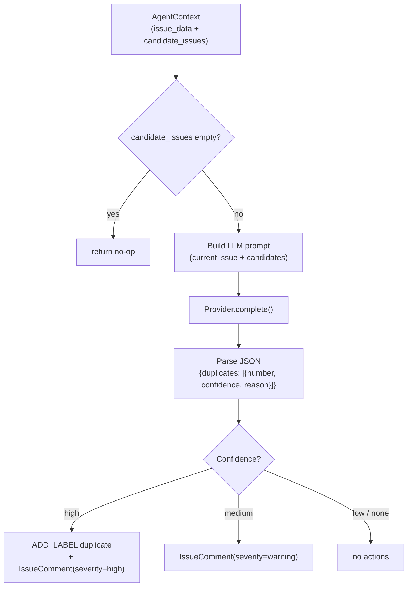
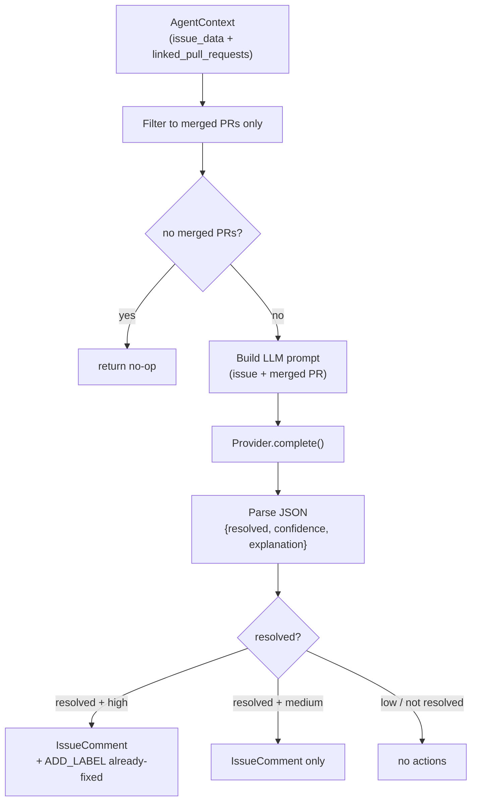
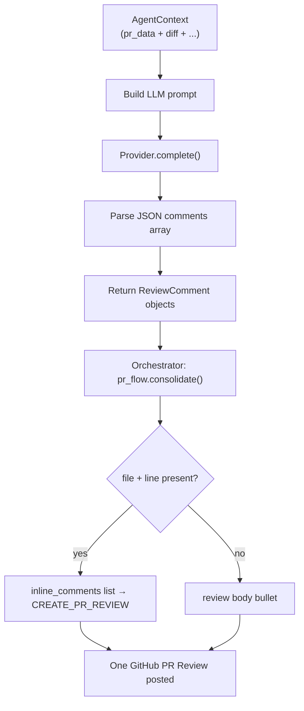

# Agents — Contract and Execution Flow

This document describes the `repoheart/agents/` package: the `Agent` base
class, the result types an agent returns, and how agents flow from an
`AgentContext` input to an `AgentResult` output. It is intended to help
contributors understand what they need to implement when adding a new agent.

## Part 1 — Agent ABC and result types

```mermaid
classDiagram
    class Agent {
        <<abstract>>
        +str name
        +RiskLevel risk_level
        +list~str~ handles_events
        +run(context: AgentContext) AgentResult
        +validate_ceiling(result) void
    }

    class AgentResult {
        +list~Finding~ findings
        +list~ReviewComment~ review_comments
        +list~IssueComment~ issue_comments
        +list~ProposedAction~ proposed_actions
        +float confidence
        +bool needs_human_review
        +str explanation
    }

    class Finding {
        +str summary
        +str detail
        +list~str~ references
        note: "Status/error messages only.\nNot for user-facing content."
    }

    class ReviewComment {
        +str title
        +str body
        +str severity
        +str|None file
        +int|None line
        +int|None end_line
        +str|None suggestion
        +str|None category
        +str source
        note: "PR agent output.\nOrchestrator delivers as inline review or body."
    }

    class IssueComment {
        +str title
        +str body
        +str severity
        +list~str~ references
        +str source
        note: "Issue agent output.\nOrchestrator formats and posts."
    }

    class ProposedAction {
        +ActionKind kind
        +dict payload
        +str reason
        +RiskLevel risk
        note: "Non-content actions only:\nADD_LABEL, CREATE_PR_REVIEW, etc."
    }

    IssueTriageAgent --|> Agent
    DuplicateDetectionAgent --|> Agent
    IssueResolutionAgent --|> Agent
    PRReviewAgent --|> Agent
    CodeQualityAgent --|> Agent
    SecurityAgent --|> Agent
    TestCoverageAgent --|> Agent
    NoOpAgent --|> Agent

    AgentResult "1" --> "*" Finding
    AgentResult "1" --> "*" ReviewComment
    AgentResult "1" --> "*" IssueComment
    AgentResult "1" --> "*" ProposedAction
```

`Agent` is an abstract base class. Subclasses set `name`, `risk_level`, and
`handles_events`, and implement `run()`, which returns a declarative
`AgentResult`. An agent never executes writes — the orchestrator and Safety
Gate decide which `ProposedAction`s actually run.

### Agent Output Conventions

| Output type | Use for | Who consumes it |
|---|---|---|
| `ReviewComment` | Code findings for PRs (file, line, severity, suggestion) | `pr_flow.consolidate()` → `CREATE_PR_REVIEW` |
| `IssueComment` | Issue-level findings (triage, duplicates, resolution) | `issue_flow.format_issue_comment()` → `POST_COMMENT` |
| `Finding` | Internal status, errors, diagnostics only | Logged; never shown to developers |
| `ProposedAction` | Non-content actions: `ADD_LABEL`, `CREATE_PR_REVIEW` | Safety Gate → GitHub |

**PR agents** (`pr_review`, `code_quality`, `security`, `test`) return
`review_comments: list[ReviewComment]` — no `POST_COMMENT` proposals.

**Issue agents** (`issue_triage`, `duplicate_detection`, `issue_resolution`)
return `issue_comments: list[IssueComment]` — no `POST_COMMENT` proposals.

Both may still propose `ADD_LABEL`.

## Part 2 — AgentContext fields

`AgentContext` is a frozen dataclass; it is the read-only view of the world
passed into every agent. The orchestrator pre-fetches data so agents never
hold live clients.

| Field | Type | Notes |
| --- | --- | --- |
| `event` | `InternalEvent` | Normalized GitHub event that triggered the agent |
| `config` | `RepoHeartConfig` | Validated configuration for the repository |
| `provider` | `Provider \| None` | AI provider for this run |
| `issue_data` | `dict \| None` | Pre-fetched issue payload for `issues.*` events |
| `pr_data` | `dict \| None` | Pre-fetched PR payload for `pull_request.*` events |
| `diff` | `str` | Unified diff for PR/push events |
| `changed_files` | `list[str]` | Relative paths of changed files |
| `fingerprint` | `str` | Unique per-run fingerprint (for logging) |
| `repo_labels` | `list[dict]` | Pre-fetched for `issue_triage` |
| `candidate_issues` | `list[dict]` | Pre-fetched for `duplicate_detection` |
| `linked_pull_requests` | `list[dict]` | Pre-fetched for `issue_resolution` |
| `linter_output` | `str` | ruff + mypy output for `code_quality` |
| `secret_scan_output` | `str` | detect-secrets output for `security` |
| `test_mapping` | `dict[str, list[str]]` | Module→test file map for `test` |

## Part 3 — Per-agent execution flow

### Issue agents (produce IssueComment)

#### IssueTriageAgent

#### DuplicateDetectionAgent

#### IssueResolutionAgent

### PR agents (produce ReviewComment)

All four PR agents follow the same pattern: build LLM prompt → parse
`"comments"` array → return `ReviewComment` objects. No self-posting.

## Part 4 — AGENT_REGISTRY

| Agent slot | Implementation | Output type |
| --- | --- | --- |
| `issue_triage` | `IssueTriageAgent` | `IssueComment` |
| `duplicate_detection` | `DuplicateDetectionAgent` | `IssueComment` |
| `issue_resolution` | `IssueResolutionAgent` | `IssueComment` |
| `pr_review` | `PRReviewAgent` | `ReviewComment` |
| `code_quality` | `CodeQualityAgent` | `ReviewComment` |
| `security` | `SecurityAgent` | `ReviewComment` |
| `test` | `TestCoverageAgent` | `ReviewComment` |
| `ci_repair` | `NoOpAgent` | — |
| `conflict_resolution` | `NoOpAgent` | — |
| `documentation` | `NoOpAgent` | — |

## Part 5 — Adding a New Agent

1. Subclass `Agent` in `agents/<name>.py`; set `name`, `risk_level` (ceiling), `handles_events`.
2. Implement `run(context) → AgentResult`:
   - For PR-scoped code findings: populate `result.review_comments` with `ReviewComment` objects.
   - For issue-scoped findings: populate `result.issue_comments` with `IssueComment` objects.
   - Use `Finding` only for status / error / diagnostic messages (never shown to developers).
   - Use `ProposedAction` only for non-content actions (`ADD_LABEL`, etc.).
   - Never propose `POST_COMMENT` with a pre-formatted body.
3. Register the agent's event types in `events/router.py`.
4. Add to `AGENT_REGISTRY` in `agents/registry.py`.
5. Add config toggle in `repoheart.yml` schema + `repoheart.schema.json`.
6. Add a unit test asserting `review_comments` or `issue_comments` + risk ceiling.
7. Update the registry table above.
